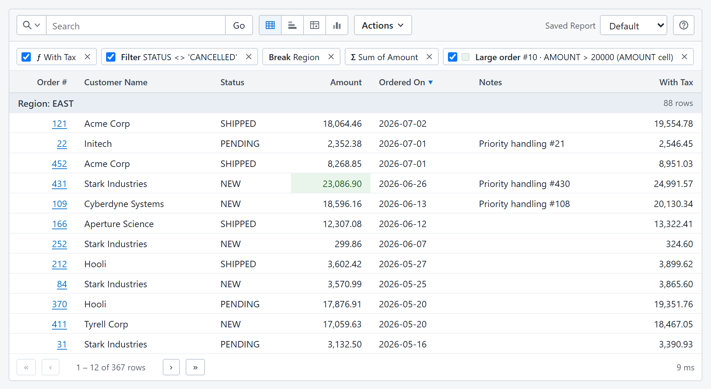

<h1 align="center">Interactive Reports</h1>

<p align="center">
  Oracle APEX-style interactive reports for ASP.NET Core.<br>
  A developer writes one <code>SELECT</code>; users get a report they can search, filter, sort, break, compute, highlight, group, pivot, chart, save, and download.
</p>

<p align="center">
  <a href="LICENSE"></a>
  
  
  <a href="https://interactive-report.pages.dev/"></a>
</p>



<p align="center">
  <strong><a href="https://interactive-report.pages.dev/">🚀 Try the Interactive Demo</a></strong>
</p>

## What it is

A report is a piece of configuration: a name, a data source, and a `SELECT`. From
that one statement the server discovers the columns and the browser element gives
users a workspace over the result. Everything a user does becomes a
JSON **report state document** that the server validates and compiles into
parameterized SQL, pushed down to the database. Nothing the user types ever reaches
the database as SQL text.

- **Search, filter, sort, and page** with a typed expression language that is the
  same on every supported database.
- **Shape the data**: control breaks with subtotals, aggregates, computed columns,
  row and cell highlights, Group By, Pivot, and charts.
- **Save and share** layouts as private or published saved reports, or ship them as
  source-controlled JSON files beside the application.
- **Download** the current view as CSV, with every row and the user's formatting.
- **Secure by construction**: the developer owns the SQL and the trusted context
  parameters; users own state, and state is always data. Report and saved-report
  access run through the host's own ASP.NET Core identity and authorization.
- **No front-end build.** The UI is a self-contained custom element embedded in the
  NuGet package, with ready-made viewer and administration pages, English and Canadian
  French, and built-in help.
- **SQL Server, PostgreSQL, Oracle, and SQLite** all enjoy first class support.

## Quick start

Install packages via the command line:

```sh
dotnet add package InteractiveReport.AspNetCore
dotnet add package InteractiveReport.Client.Json
```

Configure a report in `appsettings.json`:

```json
"InteractiveReport": {
  "Reports": {
    "orders": {
      "dataSource": "MainDb",
      "sql": "SELECT ORDER_ID, CUSTOMER, AMOUNT, ORDER_DATE FROM ORDERS",
      "authorization": { "allowAnonymous": true }
    }
  }
}
```

Register services and map endpoints in `Program.cs`:

```csharp
builder.Services.AddInteractiveReports(builder.Configuration);
builder.Services.AddInteractiveReportJson();
// …
app.MapInteractiveReportJson("/api/reports");
```

Browse to `/api/reports/orders/view`, or drop the element into any page:

```html
<script type="module" src="/api/reports/ui/ir.js"></script>
<interactive-report report="orders"></interactive-report>
```

The [Getting started guide](docs/GETTING-STARTED.md) continues from here with
saved-report storage, the administration page, authorization, and the rest.

> [!WARNING]
> Internet-facing deployment is technically supported, but it is not the recommended
> topology. Prefer an internal or otherwise trusted network. If the application must be
> exposed publicly, point reports at a dedicated reporting database or read replica
> through a least-privileged, read-only principal. Do not run interactive reporting
> workloads against the primary production database.

## Documentation

| Guide | Read it for |
|---|---|
| [Getting started](docs/GETTING-STARTED.md) | Packages, configuration, data sources, Umbraco, saved-report storage, configured report documents, administration, logging, localization. |
| [User Guide](docs/USER-GUIDE.md) | The end-user manual for the report UI. It is also the built-in help behind the toolbar's **?** button. |
| [Embedding the report](docs/EMBEDDING.md) | The custom element, host JavaScript API, events, client controls, theming, stylesheets, renderers, and edit links. |
| [Integration API](docs/API.md) | Server registration, authorization hooks, trusted context, in-process execution and export, REST routes, and element reference tables. |
| [Authorization](docs/AUTHORIZATION.md) | The action and resource model, the three integration styles, administrator resolution, and denial behaviour. |
| [GraphQL adapter](docs/GRAPHQL.md) | The optional query-only transport for saved reports. |
| [Architecture](docs/ARCHITECTURE.md) | The trust boundary, the report state document, composition, the expression language, dialects, and the decision log. |
| [Developing](docs/DEVELOPING.md) | Building the client, running the test layers, packing, and regenerating documentation screenshots. |
| [Testing](docs/TESTING.md) | The everyday suite, browser automation, and live-dialect verification. |

## Developing

```sh
npm ci && npm run build      # browser bundles and the packaged help page
npm run build:demo           # standalone in-browser demo for Cloudflare Pages
dotnet run --project samples/Workbench
```

The Workbench at `http://localhost:5042` hosts every packaged page against a seeded
SQLite database. `npm test` runs the client unit tests and `npm run verify` adds the
Playwright suite; `dotnet test` covers the server. See [Developing](docs/DEVELOPING.md).

## License

[MIT](LICENSE)
