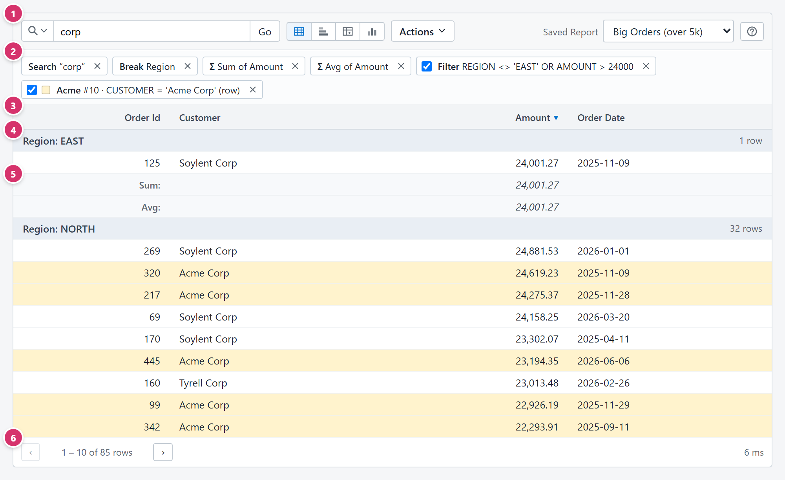
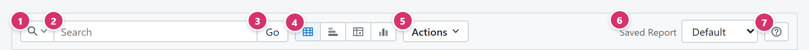
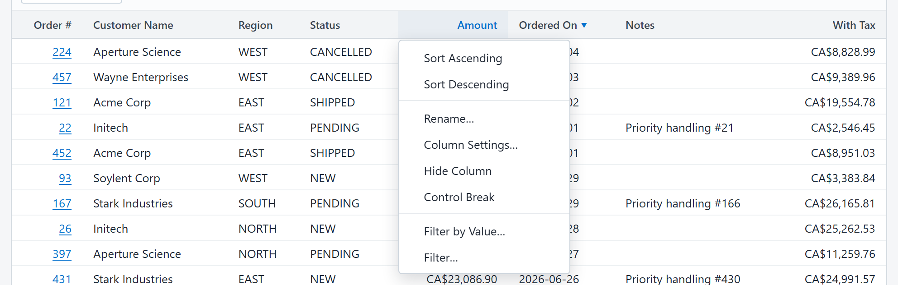
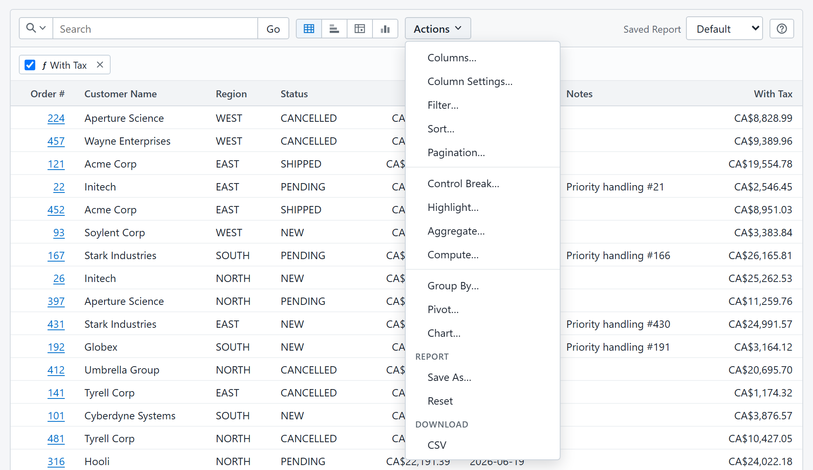
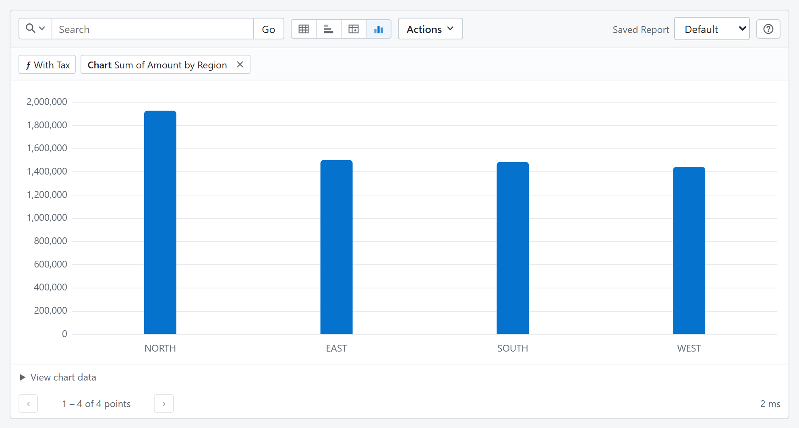

# Interactive Report — User Guide

This guide explains how to use an interactive report: how to search, filter, sort,
shape, save, and download the data a report shows you. It covers everything the report
can offer. Your report may hide some of these controls, because each report decides
which features it makes available.

Contents

1. [The report at a glance](#the-report-at-a-glance)
2. [The toolbar](#the-toolbar)
3. [Searching](#searching)
4. [Settings chips](#settings-chips)
5. [Column header menu](#column-header-menu)
6. [The Actions menu](#the-actions-menu)
7. [Views: Grid, Group By, Pivot, Chart](#views)
8. [Writing expressions](#writing-expressions)
9. [Saved reports](#saved-reports)
10. [Downloading](#downloading)
11. [Paging, status, and messages](#paging-status-and-messages)
12. [Windows, menus, and keyboard use](#windows-menus-and-keyboard-use)
13. [Appendix: the administration page](#appendix-the-administration-page)

---

## The report at a glance

1. **Toolbar.** Search, switch views, open the Actions menu, pick a saved report, and
   open this guide with the **?** button.
2. **Settings chips.** One chip per active setting: the search text, each filter,
   control break, aggregate, computed column, highlight, and the current view. Chips
   let you switch a setting off, edit it, or remove it without opening a menu.
3. **Column headings.** Click a heading to open its menu (sort, rename, hide, break,
   filter). Sort indicators (▲ ▼) show the current order.
4. **Control-break heading.** When the report is broken on a column, rows are grouped
   under a heading that shows the break value and the number of rows in the group.
5. **Subtotal row.** Aggregates you add (Sum, Avg, …) are repeated for each break group,
   and a grand-total row appears at the end of the report.
6. **Pager.** Move between pages and see which rows are shown. The time the query took
   is shown on the right.

Rows tinted a different colour are matched by a **highlight** rule. A thin progress
strip under the toolbar animates while the report is loading.

A pencil icon at the start of a row, when present, is an **edit link** the report's
author added. It opens the matching record; middle-click or Ctrl+click opens it in a
new tab. Edit links appear only in the Grid view.

---

## The toolbar

| # | Control | What it does |
|---|---|---|
| 1 | **Search scope** | Opens a menu to choose what the search box searches: *All Text Columns* (the default) or one specific column. |
| 2 | **Search box** | Type the text or value to search for. The placeholder shows the current scope, for example *Search: Customer Name*. |
| 3 | **Go** | Runs the search. Pressing Enter in the search box does the same. |
| 4 | **View buttons** | Switch between Grid, Group By, Pivot, and Chart. The active view is tinted. Views that the report does not offer are hidden. |
| 5 | **Actions** | Opens the menu of everything you can do to the report. See [The Actions menu](#the-actions-menu). |
| 6 | **Saved Report** | Loads one of the report's saved layouts. Hidden when the report has no saved reports. See [Saved reports](#saved-reports). |
| 7 | **Help** | Opens this guide in a window you can keep open, and move aside, while you work. |

The toolbar wraps onto more than one line when the window is narrow.

---

## Searching

### Search all text columns

Leave the scope on *All Text Columns*, type a word, and press Enter or **Go**. Every
text column is searched for rows that **contain** the text anywhere, ignoring case.
A *Search* chip appears under the toolbar. To clear the search, remove the chip, or
empty the box and press **Go**.

### Search one column

Click the search-scope button (the magnifier with a small arrow) and pick a column.
The placeholder changes to *Search: Column*. Press Enter or **Go** and the value becomes
a **filter chip** rather than a search chip, so you can stack several column searches,
switch each one off, or edit it as an expression.

What you type depends on the column type:

| Column type | What to type | Matches |
|---|---|---|
| Text | Any text | Rows whose value contains the text, ignoring case |
| Number | A number, for example `1234.5` or `1,234.5` | Rows equal to that number |
| Date | A date as `YYYY-MM-DD`, for example `2026-03-31` | Rows equal to that date |
| Yes/No | `true`, `false`, `1`, or `0` | Rows with that value |

A value the column cannot understand shows an error, for example *"abc" is not a
number*, and nothing is added. Columns of other types cannot be chosen as a scope.

For more control, use **Filter by Value…** or **Filter…** from a column heading or the
Actions menu.

---

## Settings chips

Everything you have applied to the report shows as a chip under the toolbar. The chip
strip is hidden when there is nothing to show.

| Chip | Example | Controls |
|---|---|---|
| Search | **Search** "corp" | Click the text to jump back to the search box. × removes it. |
| Filter | **Filter** AMOUNT > 1000 | Checkbox switches the filter off and on. Click the text to edit. × removes it. |
| Control break | **Break** Region | Click the text to edit the break list. × removes this break. |
| Aggregate | **Σ** Sum of Amount | Click the text to edit the aggregate list. × removes this aggregate. |
| Computed column | **ƒ** With Tax | Checkbox switches the column off and on. Click the text to edit. × removes it. |
| Highlight | ■ **Acme** #10 · CUSTOMER = 'Acme Corp' (row) | Colour swatch, sequence number, rule, and scope. Checkbox switches it off and on. Click to edit. × removes it. |
| View | **Group by** Region | Click the text to change the view's settings. × returns to the Grid view. |

A switched-off setting is kept but not applied. It is shown dimmed and is saved with
the report, so you can bring a filter or highlight back later without retyping it.

Removing a computed column also removes anything that depended on it, such as a filter
or a chart value that used it. A message tells you what was removed.

Chips with no checkbox, edit, or × are **locked**: the setting came from the report's
configuration or from a feature this report does not let you change. You can still leave
a locked view for the Grid.

---

## Column header menu

Click any column heading to open its menu.

| Entry | What it does |
|---|---|
| **Sort Ascending / Sort Descending** | Sorts the report by this one column and replaces any previous sort. Use **Actions → Sort…** to sort by several columns. |
| **Rename…** | Changes the column heading shown in this report. Expressions keep using the original column name. Leave the box blank to restore the default heading. |
| **Column Settings…** | Opens the column's display settings (alignment, format, colours, link or image display). See [Column Settings](#column-settings). |
| **Hide Column** | Removes the column from the report. Use **Actions → Columns…** to bring it back. The last visible column cannot be hidden. |
| **Control Break** | Groups rows by this column. A ✓ shows the column is already a break; choosing it again removes the break. |
| **Filter by Value…** | Picks a value from a list of the column's actual values and filters to it. See [Filter by Value](#filter-by-value). |
| **Filter…** | Opens the filter editor with this column already inserted. |

Some entries are missing when the report's author has made a column unsortable or
unfilterable. A short **help note** may appear at the bottom of the menu when the author
has described the column.

The heading of a sorted column shows ▲ (ascending) or ▼ (descending). When more than
one column is sorted, a small number shows the sort order.

---

## The Actions menu

Entries the current view cannot use are greyed out. Entries the report does not offer
are not shown at all.

| Entry | Purpose |
|---|---|
| [Columns…](#columns) | Choose which columns display, and in what order. |
| [Column Settings…](#column-settings) | Alignment, number and date formats, colours, links, and images. |
| [Filter…](#filter) | Add a filter written as an expression. |
| [Sort…](#sort) | Sort by up to six columns. |
| [Pagination…](#pagination) | How many rows a page shows. |
| [Control Break…](#control-break) | Group rows under headings, with subtotals. |
| [Highlight…](#highlight) | Colour rows or cells that match a rule. |
| [Aggregate…](#aggregate) | Totals, averages, counts, and more. |
| [Compute…](#compute) | Add a column calculated from other columns. |
| [Group By…](#group-by) | Summarise rows by one to three columns. |
| [Pivot…](#pivot) | Cross-tabulate two sets of columns. |
| [Chart…](#chart) | Draw the data as a bar, line, area, or pie chart. |
| **Report: Save / Save As… / Delete… / Reset** | Manage saved reports. See [Saved reports](#saved-reports). |
| **Download: CSV** | Download the current report. See [Downloading](#downloading). |

Every dialog has an **Apply** button (sometimes named for the action, such as **Save**)
and **Cancel**. Applying re-runs the report straight away. If the server rejects the
change, the reason is shown inside the dialog and the dialog stays open so you can fix
it; the report keeps its previous settings.

### Columns

Two lists: **Do Not Display** on the left and **Display in Report** on the right. Select
one or more names (Ctrl+click or Shift+click to select several) and use the buttons
between the lists:

| Button | Action |
|---|---|
| › | Display the selected columns |
| ‹ | Hide the selected columns |
| » | Display all |
| « | Hide all |
| ↑ ↓ | Move the selected displayed columns up or down |

The order of the right-hand list is the order of the columns in the report. At least one
column must be displayed. Computed columns are marked **ƒ**. In the Group By and Pivot
views the group columns always display.

### Column Settings

Pick a column at the top of the dialog, change its settings, and pick another column if
you like: changes are kept for every column you visit and are all applied together when
you press **Apply**. The **Preview** at the bottom shows a real value from the report
with the current settings.

| Setting | Meaning |
|---|---|
| **Visible** | Same as showing or hiding the column in **Columns…**. A column shown again is added at the end. |
| **Display As** | *Text (Default)*, *Link*, or *Image*. For a link, **URL Column** is the column holding the address and **Link Text Column** the column holding the text to show. For an image, **URL Column** holds the image address. Only `http`, `https`, `mailto`, and `tel` addresses become links, and only `http` and `https` addresses become images. |
| **Alignment** | Left, Center, Right, or the default (numbers right, everything else left). |
| **Format Mask** | Number columns: *Number* with 0 to 4 decimals, *Plain* (no grouping separators), *Currency* (CAD, USD, EUR, GBP, JPY), and *Percent* with 0 to 2 decimals (0.25 displays as 25%). Date columns: date only, date and time, with seconds, time only, and medium or long written forms. Each choice shows an example in your language. |
| **Bold / Italic** | Text style for the column's cells. |
| **Text / Background** | Tick the box and pick a colour. Highlight rules take precedence over column colours. |
| **CSS Classes** | For page designers: class names from the hosting page's stylesheet, separated by spaces. Names starting with `ir-` are reserved. |

### Filter

A filter keeps only the rows for which its condition is true. Filters can be written
in two ways:

- **Pick a value.** Choose a column under **Value Column**, press **Choose from
  Values…**, and pick from the list. The dialog writes the condition for you.
- **Write an expression.** Type a condition such as `AMOUNT > 1000 AND STATUS <>
  'CANCELLED'`. The **Columns**, **Functions**, and **Conditions** buttons insert the
  right spelling at the cursor. See [Writing expressions](#writing-expressions).

Each filter becomes its own chip. Several filters all apply at once (every one of them
must be true). To combine conditions with *or*, write one filter using `OR`.

### Filter by Value

Opens a list of the distinct values the column currently holds, taking the other
filters into account. The list shows the first 50 values; type in the search box to
narrow it. `(Null)` stands for rows with no value and `(Empty)` for an empty text.

- Click a value to filter on it. Text matches exactly, ignoring case.
- Or type a value and press **Use Typed Value**. Typed text also matches exactly unless
  it contains `*`, which matches any run of characters: `Acme*` matches everything that
  starts with "Acme". Type `\*` to match a literal asterisk.

### Sort

Up to six rows of **Column**, **Direction** (Ascending or Descending), and **Null
Sorting** (whether empty values come first, last, or wherever the database puts them).
The first row is the primary sort. Remove a row with its × button. Control-break columns
always sort before these; in a Pivot the row dimensions come first.

### Pagination

**Limit** sets the number of rows per page: 10, 50, 100, 500, or 1000 (up to the
maximum the report allows), or **All**, which returns every matching row in one page.

### Control Break

Choose up to three **Break Columns**. Rows are grouped under a heading for each
distinct value, in the order of the columns you list. The heading shows the value and
the row count of the group; the break column itself is removed from the detail rows.
Any aggregates you add are subtotalled per group.

### Highlight

Colours rows or single cells that match a condition.

| Field | Meaning |
|---|---|
| **Name** | The label shown on the chip. |
| **Sequence** | The order highlights apply in when several match the same row. Higher numbers apply later and win where colours overlap. |
| **Apply To** | *Row* colours the whole row; *Cell* colours only the **Highlight Column**. |
| **When** | The condition. Use **Choose from Values…** to pick a value, or write an expression. |
| **Background / Text** | Tick at least one and pick a colour. |

Cell highlights are applied after row highlights, so a cell colour shows on top of a
row colour. A switched-off highlight keeps its place in the sequence.

### Aggregate

Adds summary rows: choose a **Function** and a **Column** per row, and add as many
rows as you need. The functions offered depend on the column's type:

| Function | Result |
|---|---|
| Sum | Total of the values |
| Avg | Mean of the values |
| Median | Middle value |
| Min / Max | Smallest and largest value |
| Count | Number of rows with a value |
| Count Distinct | Number of different values |

Aggregates are computed over the **whole filtered report**, not just the visible page.
The grand-total row appears at the end of the last page (or straight away when the page
size is **All**). With control breaks, each group also gets its subtotal rows.

### Compute

Adds a new column calculated from other columns.

- **Column Heading** is the name shown in the report. Leave it blank for a generated
  name such as `ir1`.
- **Expression** must produce a number, text, or date, for example
  `ROUND(AMOUNT * 1.13, 2)` or `UPPER(CUSTOMER) || ' (' || REGION || ')'`. Use `CASE
  WHEN … THEN … ELSE … END` to turn a condition into a value.

A computed column behaves like any other: it can be sorted, filtered, formatted,
aggregated, charted, and used in other computed columns. It is marked **ƒ** in lists.
In the Group By and Pivot views, a computed column works on the summarised table, so it
can combine the group's values and counts (for example an average from a sum and a
count).

---

## Views

The four view buttons on the toolbar switch between ways of looking at the same data.
The first time you open Group By, Pivot, or Chart, its dialog asks how to shape the data;
afterwards the button switches straight to the view you set up, and the **view chip**
reopens the dialog. Each view keeps its own column selection, sorting, filters,
formats, and computed columns. Remove the view chip, or press the Grid button, to return
to the detail rows.

### Grid

The detail rows, one per record. Everything in this guide applies to the Grid.

### Group By

Summarises the rows.

- **Group by**: one to three columns. Each distinct combination becomes one row.
- **Values**: any number of *Function of Column* aggregates (Sum, Avg, Median, Min, Max,
  Count, Count Distinct) shown as columns.
- A **row count** per group is always included.

The pager counts groups instead of rows. Sorting, filtering, and highlighting in this
view apply to the grouped rows.

### Pivot

Cross-tabulates the data.

- **Rows**: one or two columns whose values become the rows.
- **Columns (become headings)**: one or two columns whose distinct values become the
  column headings.
- **Values**: the aggregates to show in each cell. With no values, each cell shows a
  count.
- **Show total rows** adds totals.

A column cannot be both a row and a column dimension. Every generated column can be
sorted, hidden, or formatted like an ordinary column.

### Chart

| Field | Meaning |
|---|---|
| **Chart Type** | Bar, Line, Line with Area, or Pie. |
| **Label** | The column whose values appear along the label axis (or as pie slices). |
| **Value** | *Function of Column*: what each bar or point measures. **— Row Count —** counts rows per label. A numeric column also offers **— Each Row —**, which plots every row without summarising. |
| **Orientation** | Vertical or Horizontal (not for pie). |
| **Sort** | Order the labels by Label or by Value, ascending or descending. |
| **Label Axis Title / Value Axis Title** | Optional axis captions (not for pie). |

The chart draws the **whole filtered result**, never just one page, up to the report's
point limit; the pager shows how many points were drawn. Hover over a bar or point for
its value. **View chart data** under the chart opens the same numbers as a table, which
is also what screen readers and copy-and-paste use.

---

## Writing expressions

Filters, highlights, and computed columns share one small expression language. It looks
like SQL but is deliberately limited and portable: the same expression works on every
database the report may run on. The dialog's **Columns**, **Functions**, and
**Conditions** buttons insert each piece with the right spelling.

### Basics

- **Column names** are inserted by the Columns buttons. Unusual names are wrapped in
  backticks, for example `` `Order Total` ``.
- **Text** goes in single quotes: `'SHIPPED'`. Double a quote inside text:
  `'O''Brien'`.
- **Numbers** are written plainly: `1000`, `0.15`, `-2`.
- **Dates** are written with `TO_DATE('YYYY-MM-DD')`: `TO_DATE('2026-01-31')`.
- **Empty values** are tested with `IS NULL` and `IS NOT NULL`. Writing `= NULL` is
  rejected because it can never match.

### Conditions (filters and highlights)

A condition must be true or false for each row.

| Write | Meaning |
|---|---|
| `AMOUNT > 1000` | Comparison: `=`, `<>` (not equal), `<`, `<=`, `>`, `>=` |
| `AMOUNT BETWEEN 100 AND 500` | Inclusive range |
| `STATUS = 'NEW' OR STATUS = 'PENDING'` | Either condition |
| `REGION = 'EAST' AND NOT STATUS = 'CANCELLED'` | Both, with negation |
| `NOTES IS NULL` | No value |
| `IN_LIST(STATUS, 'NEW', 'PENDING')` | Value is one of the list |
| `CONTAINS(CUSTOMER, 'corp')` | Text contains, ignoring case |
| `STARTS_WITH(CUSTOMER, 'A')`, `ENDS_WITH(CUSTOMER, 'Inc')` | Text begins or ends with, ignoring case |
| `WILDCARD_MATCH(CUSTOMER, 'A*Corp')` | Pattern with `*` for any characters (`\*` for a literal asterisk) |
| `ORDER_DATE >= TO_DATE('2026-01-01')` | On or after a date |
| `ORDER_DATE >= DATE_TRUNC('MONTH', NOW())` | Since the start of this month |
| `DATE_TRUNC('DAY', ORDER_DATE) = TO_DATE('2026-03-31')` | On a particular day (ignoring the time of day) |
| `ORDER_DATE < NOW() - 30` | More than 30 days ago |
| `IS_PRIORITY` | A yes/no column can stand on its own as a condition |

Text comparisons with `=` are case-sensitive or not depending on the database; use
`CONTAINS`, `STARTS_WITH`, `ENDS_WITH`, or `LOWER(...) = 'value'` when case must not
matter.

### Values (computed columns)

A computed column must produce a number, text, or date. Conditions are not values: to
show a condition, wrap it in `CASE`.

| Write | Result |
|---|---|
| `AMOUNT * 1.13` | Arithmetic with `+`, `-`, `*`, `/`. Division always keeps decimals. |
| `ROUND(AMOUNT * 1.13, 2)` | Rounded to 2 decimals (`ROUND(x)` rounds to a whole number) |
| `ABS(BALANCE)` | Absolute value |
| `CUSTOMER || ' — ' || REGION` | Joined text (`CONCAT(a, b, …)` does the same, up to 8 pieces) |
| `UPPER(REGION)`, `LOWER(EMAIL)`, `TRIM(NOTES)` | Case and whitespace |
| `LENGTH(NOTES)` | Number of characters |
| `SUBSTR(ORDER_CODE, 1, 3)` | Part of a text, starting at position 1 |
| `COALESCE(NOTES, '(none)')` | First value that is not empty (up to 8 choices) |
| `CASE WHEN AMOUNT > 1000 THEN 'Large' ELSE 'Small' END` | A value chosen by conditions; several `WHEN`s are allowed |
| `CASE REGION WHEN 'EAST' THEN 1 WHEN 'WEST' THEN 2 ELSE 9 END` | A value chosen by matching one column |
| `YEAR(ORDER_DATE)`, `MONTH(ORDER_DATE)`, `DAY(ORDER_DATE)` | Parts of a date as numbers |
| `ORDER_DATE + 30` | A date moved by whole days |
| `DATE_TRUNC('MONTH', ORDER_DATE)` | Start of the day, month, or year |
| `TO_STRING(ORDER_DATE, 'YYYY-MM')` | A date as text. Tokens: `YYYY MM DD HH24 MI SS`; separators: space, `-`, `/`, `:`, `T`. Without a format, `YYYY-MM-DD`. |
| `NOW()` | The current date and time (UTC) when the report runs |

Computed columns can use other computed columns. Dates cannot be joined to text
directly; convert them with `TO_STRING` first. A `CASE` without `ELSE` leaves the
value empty for rows that match nothing.

If an expression is wrong, the message under the dialog says what to fix and where.
The report keeps running with its previous settings until the expression is accepted.

---

## Saved reports

A saved report stores the complete layout you have built: search, filters, sorting,
columns and their settings, breaks, aggregates, computed columns, highlights, and the
view. The **Saved Report** selector on the toolbar lists what is available:

- **Public**: the report's **Default** and any layouts an administrator has published.
  Everyone who can open the report sees these.
- **Private**: layouts you saved for yourself.

Choosing an entry loads it and replaces what is on screen. Anything you have changed
but not saved is lost, so save first if you want to keep it.

While you work, your changes live in a working copy. They are not stored until you save.

| Action (Actions → Report) | What it does |
|---|---|
| **Save** | Overwrites the saved report you are working on. Offered only for your own saved reports, or for any editable one if you are an administrator. |
| **Save As…** | Saves the current layout under a new **Name**. Administrators also see a **Global** checkbox that publishes the layout to everyone with access to the report. |
| **Delete…** | Deletes the saved report you are working on, after confirmation. The report then returns to its Default. |
| **Reset** | Throws away unsaved changes and reloads the saved report you started from, or the Default. Asks for confirmation. |

Saving under a name you already use asks whether to **Replace** that saved report. A
name that belongs to a public report you cannot change must be changed. The Default and
any layouts built into the report's configuration are read-only: use **Save As…** to
make your own editable copy.

Saved reports are checked when they load. If a saved layout refers to a column that no
longer exists, or to a feature the report no longer offers, the affected settings are
skipped and a yellow **Some settings were ignored** notice explains which ones.

---

## Downloading

**Actions → Download → CSV** downloads the report as a comma-separated file that
spreadsheets open directly. The file contains the report as you see it: the current
view, its visible columns and their headings, filters, search, sorting, and computed
columns. It contains **every matching row**, not only the current page. Number and
date format masks are applied; a link column exports its link text and an image column
its address.

Very large reports are cut off at the row limit the report's author has set. When that
happens, a notice says *Export truncated at the report's row cap*: add filters to narrow
the data and download again.

---

## Paging, status, and messages

- **Pager.** ‹ and › move one page back or forward. Between them, *1 – 50 of 500 rows*
  shows which rows you are looking at (groups in Group By view, points in Chart view).
  The right-hand side shows how long the query took in milliseconds.
- **Busy strip.** A thin animated line under the toolbar shows a query in progress.
  Quick successive changes are combined into one query.
- **Green message.** Confirmations such as *Report saved.* disappear on their own.
- **Yellow notice.** Something was skipped but the report still ran, for example *Some
  settings were ignored* or *Export truncated*. Close it with ×.
- **Red notice.** The last action failed and the report kept its previous settings. The
  message explains why; a reference code at the end helps support find the details.
  Close it with ×.
- **No data found.** The current filters and search match no rows.
- **Sign in to use this report** or **Report not found, or you do not have access.** The
  report needs a signed-in user, or your account has not been granted access. Contact
  the report's owner.

---

## Windows, menus, and keyboard use

**Dialogs are windows, not pop-ups that block the page.** You can keep a Filter or
Highlight window open while you scroll the report, and open several windows at once.
Click a window to bring it to the front.

| Action | How |
|---|---|
| Move a window | Drag its title bar, or focus the title bar and press Alt+Arrow (Shift+Alt+Arrow moves one pixel at a time). |
| Apply | Press Enter in any field, or click **Apply**. |
| Close without applying | Press Esc, click **Cancel**, or click ×. |
| Add another row in list dialogs | Click the **+ …** button; remove a row with its ×. |

On narrow screens (phones and small tablets) windows stay in a fixed position and
cannot be moved.

**Menus** (Actions, search scope, column headings) open with a click or Enter, and the
first entry is focused:

| Key | Action |
|---|---|
| ↑ ↓ | Move between entries |
| Home / End | First or last entry |
| Enter or Space | Choose the entry |
| Esc | Close the menu |
| Tab | Close the menu and move on |

Confirmations for deleting or resetting are small modal boxes: **Delete** or **Reset**
confirms, **Cancel** or Esc backs out.

The report is available in English and Canadian French; the page that hosts it chooses
the language. Numbers, dates, and currencies follow that language.

---

## Appendix: the administration page

Administrators have a separate page that lists every saved report of every report
family in one place. Everyone else sees an *Administrator access required* message
there. The list is itself an interactive report, so you can search, sort, filter, and
download it exactly as described above.

Each row shows the report family, the saved report's **Title**, its **Owner**, its
**Scope** (*Private*, *Global*, or a configured read-only document), whether it is the
family's **Default**, and when it was last modified (UTC). The buttons at the end of a
row act on that saved report:

| Button | What it does |
|---|---|
| **Publish / Unpublish** | Makes a private saved report visible to everyone with access to the report, or makes a global one private again. |
| **Make default** | Makes this saved report the layout the report opens with. The current default cannot simply be unset; choose another one instead. Not offered when the default is fixed by the application's configuration. |
| **Reassign** | Hands the saved report to another user. Pick from the list of users when the application supplies one; otherwise enter the user's identity value exactly as the sign-in reports it. |
| **State** | Shows the saved report's stored settings as JSON. |
| **Download** | Downloads those settings as a JSON file that can be kept, shared, or uploaded again. |
| **Delete** | Deletes the saved report after confirmation. This cannot be undone. |

Reports built into the application's configuration cannot be published, reassigned, or
deleted here.

Above the list:

- **Refresh** reloads the list.
- **Upload JSON…** imports a report document file (such as one produced by
  **Download**) as your own private saved report under the report family you choose.
  It can be published afterwards.
- **Authorization…** manages who may use this page and, for reports that are
  restricted to named users, which users are granted access. Entries that come from
  the application's configuration are shown but cannot be removed here.

The page shows who you are signed in as at the top.
